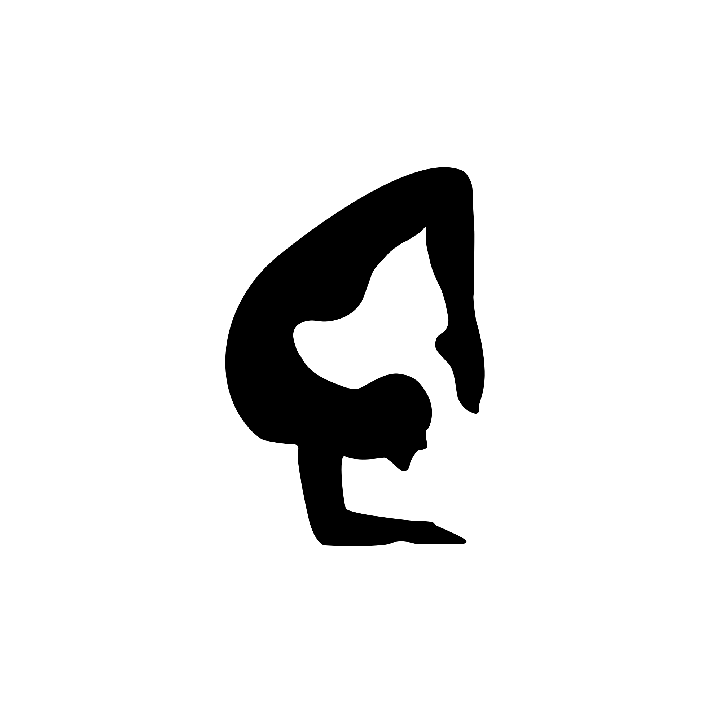

<p align="center">
  <a href="https://2flexible.com/2flex" target="_blank" rel="noopener noreferrer">
    
  </a>
</p>
<br/>
<p align="center">
  <a href="https://www.npmjs.com/package/@2flexible/2flex"></a>
  <a href="https://www.npmjs.com/package/@2flexible/2flex"></a>
  <a href="https://github.com/2flexible/2flex/graphs/contributors">

  </a>
</p>
<p align="center">
 <a href="https://2flexible.com/">Playground</a> | <a href="https://2flexible.com/docs/documentation/introduction">Introduction</a> | <a href="https://2flexible.com/docs/documentation/installation">Installation</a> | <a href="https://2flexible.com/docs/documentation/guide/the-block">Guide</a> | <a href="https://2flexible.com/docs/api/Canvas">API Docs</a> | <a href="https://x.com/2flexiible">𝕏</a>
</p>

# 2flex
Too flexible canvas library.

## Quick Start
Install the 2flex package:

```bash
npm i @2flexible/2flex
```

Initialize your canvas, then create a block to add your canvas. That’s it.
```ts
import { RectangleBlock, Canvas } from "@2flexible/2flex";

const initCanvas = new Canvas("canvas", 600, 400, {
    "background-color": "black",
});

const block = new RectangleBlock({
    x: 0,
    y: 0,
    width: 40,
    height: 40,
    backgroundColor: "red",
});

initCanvas.add(block);
```

## Contribute
See [contributing guide](https://github.com/2flexible/2flex/blob/main/CONTRIBUTING.md) to learn about contributing to 2flex.

## License
This content is released under the [MIT License](http://opensource.org/licenses/MIT).

## Change Log
[Releases](https://github.com/2flexible/2flex/releases)
